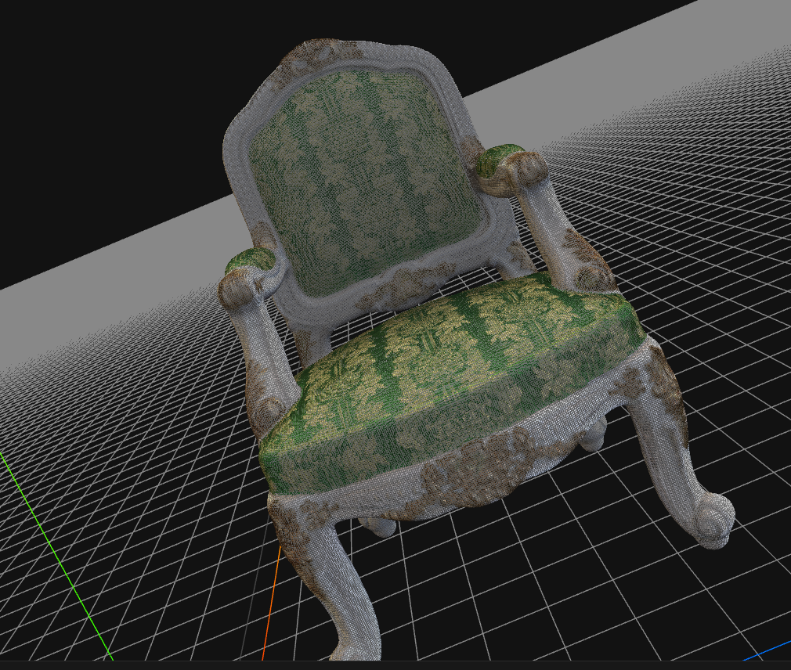
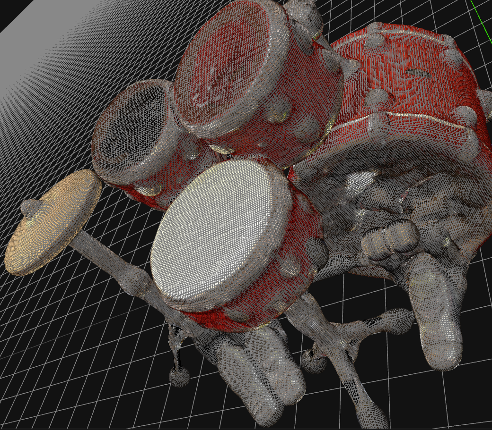
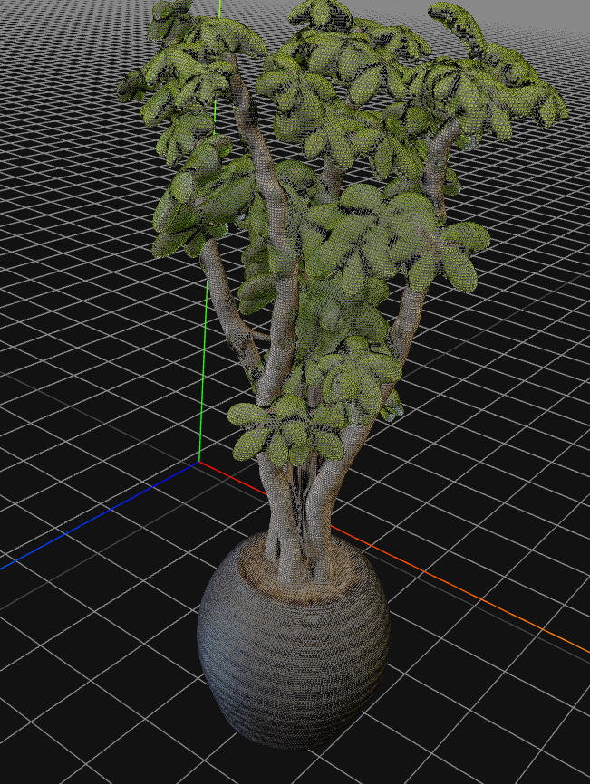
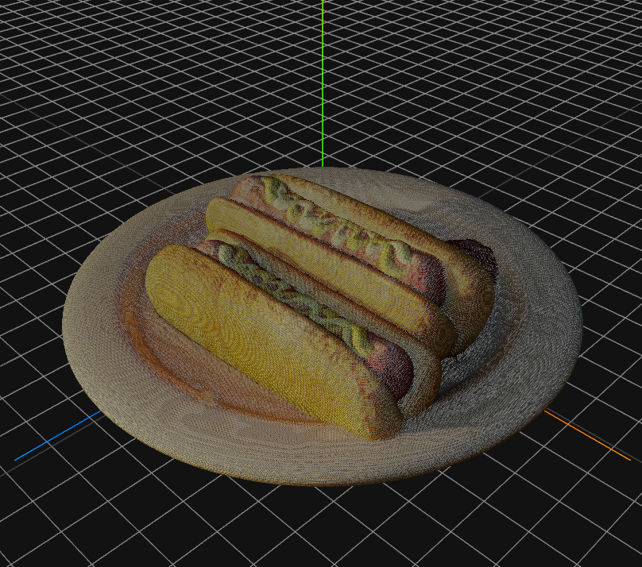
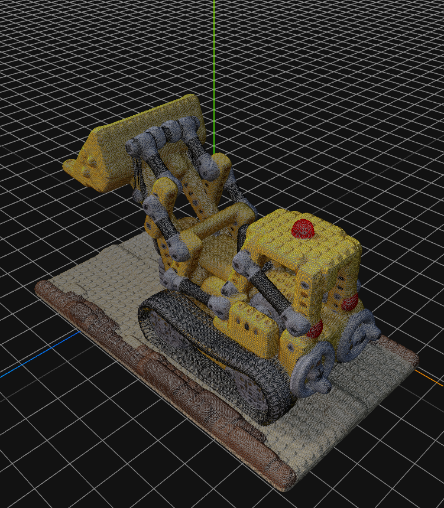
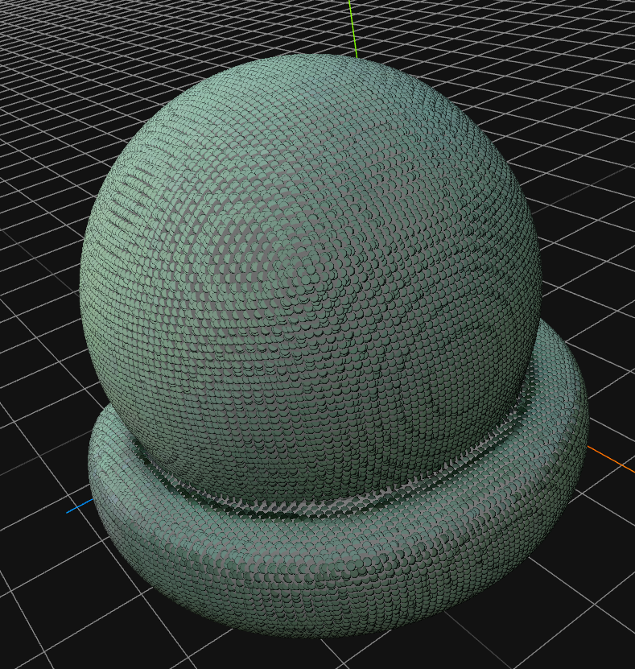
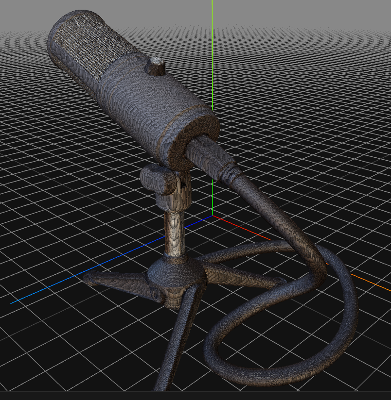
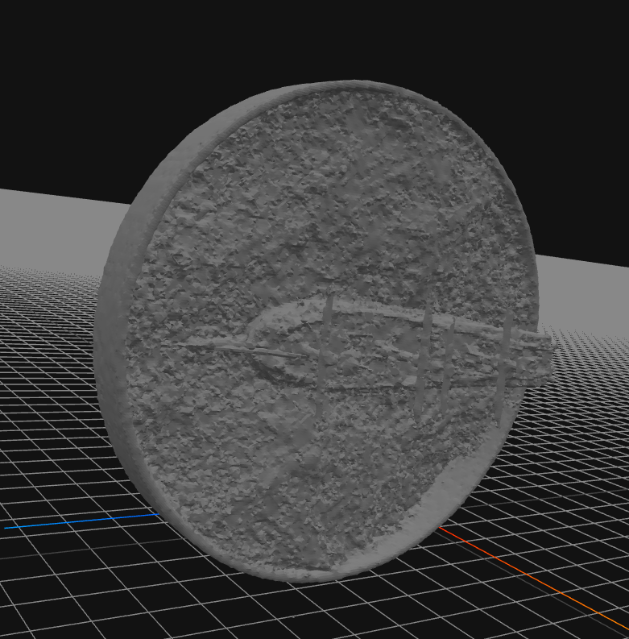

# 图形学实验4
202200130076 刘子龙

## 训练
```
python tools/run_net.py --config-file ./projects/ngp/configs/ngp_hotdog.py
python tools/run_net.py --config-file ./projects/ngp/configs/ngp_ship.py
python tools/run_net.py --config-file ./projects/ngp/configs/ngp_mic.py
python tools/run_net.py --config-file ./projects/ngp/configs/ngp_materials.py
python tools/run_net.py --config-file ./projects/ngp/configs/ngp_drums.py
python tools/run_net.py --config-file ./projects/ngp/configs/ngp_chair.py
python tools/run_net.py --config-file ./projects/ngp/configs/ngp_lego.py
python tools/run_net.py --config-file ./projects/ngp/configs/ngp_ficus.py
```

## 推理
```
python test.py
```

## 生成mesh
```
python tools/extract_mesh.py --config-file ./projects/ngp/configs/ngp_hotdog.py --resolution 512 --mcube_smooth False
```


## 1. 引言
在本实验中，我们的目标是基于可微渲染技术，通过训练集中的场景图片及对应相机参数，学习场景的三维信息，并生成新视角的图片。本报告将详细介绍实验的设计思路、实现细节、结果分析以及最终的评估。

## 2. 实验目标
- 利用可微渲染技术，从训练数据中学习场景的三维信息。
- 生成新视角的RGB图片。
- 计算输出图片与参考图片的峰值信噪比（PSNR）均值。
- 将恢复出的三维几何导出成.obj格式。

## 实验任务和数据集
### 输入数据
- 训练图片及对应相机参数。
- 包含8个不同场景，每个场景100-300张图片用于训练，20-60张图片用于验证和测试。
- 场景包含透明材质、金属材质、布料等复杂材质。

### 输出数据
- 新视角对应的RGB图片。
- 各场景输出图片与参考图片的PSNR均值。
- 三维几何的.obj模型。

## 实验环境
- 硬件：单张3080显卡。
- 操作系统：Ubuntu 20.04 LTS。
- 编程语言：Python (版本>=3.7)。
- 深度学习框架：Jittor (版本>=1.3.3)。

## 实验结果
### 输出图片
- 展示新视角的RGB图片。


### PSNR分析
- 提供各场景输出图片与参考图片的PSNR均值。

|Scene|PSNR|
|--|--|
|ficus| 34.21|
|hot dog| 37.31|
|material|36.30|
|drums| 26.57|
|lego| 29.72|
|chair| 35.03|
|mic| 37.33|
|ship|31.07|


### 三维几何重建
- 展示导出的.obj模型。








